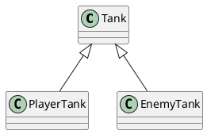
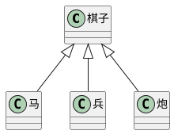

## 深入理解类和接口
面向对象
> 坦克，玩家坦克，敌方坦克
> 玩家坦克是坦克，地方坦克是坦克

如果A和B都是类，并且可以描述为A是B，则A和B形成继承关系
- B是父类，A是子类
- B派生A，A继承B
- B是A的基类，A是B的派生类


## 成员的重写
重写（override）: 子类中覆盖父类的成员
子类成员不能改变父类成员的类型

无论是属性还是方法，子类都可以对父类的相应成员进行重写，但是重写时，需要保证类型的匹配。
注意this关键字，在继承关系中，this的指向是动态的——调用方法时，根据具体的调用者确定this的指向。
super关键字：在子类的方法中，可以使用super关键字读取父类中成员
## 类型匹配
鸭子辨型法
子类的对象始终可以赋值给父类

面向对象中，这种现象，叫做里氏替换原则

如果需要判断一个数据的具体子类类型，可以使用instanceof
## protected修饰符
readonly: 只读修饰符
访问权限修饰符：private public protected：受保护的成员，只能在自身和子类中访问
当成员被标记成private时，它就不能在声明它的类的外部访问。比如：
class Animal {
    private name: string;
    constructor(theName: string) { this.name = theName; }
}

new Animal("Cat").name; // 错误: 'name' 是私有的.
## 继承的传递性和单根性
单根性： 每个类最多只能拥有一个父类
传递性： 如果A时B的父类，并且B是C的父类，则可以认为A也是C的父类
# 抽象类

## 为什么需要抽象类

有时，某个类只表示一个抽象的概念，主要用于提取子类中共有的成员，而不能直接创建它的对象，该类可以作为抽象类。
在类的前面加上```abstract```，表示该类是一个抽象类，不可以创建一个抽象类的对象。
```js
abstract class Chess {

}
class Hose extends Chess{
}
class Solider extends Chess {

}
let c = new Chess()//会报错
```
## 抽象成员
父类中，可能知道有些成员是必须存在的，但是不知道该成员的值或实现是什么。因此，需要有一种强约束，让继承该类的子类，必须要实现该成员。
***抽象类中***，可以有抽象成员，这些抽象成员必须在子类中使用。
```ts
abstract class Chess {
    x:number= 0
    y:number= 0
    abstract readonly name:string;

}
class Hose extends Chess{
    name: string = 'hose';
}

class Pao extends Chess {
    readonly name:string
    constructor() {
        super();
        this.name = '炮'
    }

}
class Solider extends Chess {
    get name() {
        return '兵'
    }
}
const h = new Hose();
const p = new Pao();
// let c = new Chess()
```

## 设计模式 - 模板模式
设计模式： 面对一些常见的功能场景，有一些固定的，经过多年实践的成熟方法，这些方法称之为设计模式。
模板模式：有些方法，所有的流程完全一致，只是流程中的步骤具体实现不一致。可以将该方法提取到父类，在父类中完成功能整个流程的实现，遇到实现不一致的方法时，将该方法做成抽象方法。