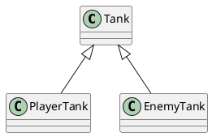
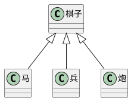

## 深入理解类和接口
面向对象
> 坦克，玩家坦克，敌方坦克
> 玩家坦克是坦克，地方坦克是坦克

如果A和B都是类，并且可以描述为A是B，则A和B形成继承关系
- B是父类，A是子类
- B派生A，A继承B
- B是A的基类，A是B的派生类


## 成员的重写
重写（override）: 子类中覆盖父类的成员
子类成员不能改变父类成员的类型

无论是属性还是方法，子类都可以对父类的相应成员进行重写，但是重写时，需要保证类型的匹配。
注意this关键字，在继承关系中，this的指向是动态的——调用方法时，根据具体的调用者确定this的指向。
super关键字：在子类的方法中，可以使用super关键字读取父类中成员
## 类型匹配
鸭子辨型法
子类的对象始终可以赋值给父类

面向对象中，这种现象，叫做里氏替换原则

如果需要判断一个数据的具体子类类型，可以使用instanceof
## protected修饰符
readonly: 只读修饰符
访问权限修饰符：private public protected：受保护的成员，只能在自身和子类中访问
当成员被标记成private时，它就不能在声明它的类的外部访问。比如：
class Animal {
    private name: string;
    constructor(theName: string) { this.name = theName; }
}

new Animal("Cat").name; // 错误: 'name' 是私有的.
## 继承的传递性和单根性
单根性： 每个类最多只能拥有一个父类
传递性： 如果A时B的父类，并且B是C的父类，则可以认为A也是C的父类
# 抽象类

## 为什么需要抽象类

有时，某个类只表示一个抽象的概念，主要用于提取子类中共有的成员，而不能直接创建它的对象，该类可以作为抽象类。
在类的前面加上```abstract```，表示该类是一个抽象类，不可以创建一个抽象类的对象。
```js
abstract class Chess {

}
class Hose extends Chess{
}
class Solider extends Chess {

}
let c = new Chess()//会报错
```
## 抽象成员
父类中，可能知道有些成员是必须存在的，但是不知道该成员的值或实现是什么。因此，需要有一种强约束，让继承该类的子类，必须要实现该成员。
***抽象类中***，可以有抽象成员，这些抽象成员必须在子类中使用。
```ts
abstract class Chess {
    x:number= 0
    y:number= 0
    abstract readonly name:string;

}
class Hose extends Chess{
    name: string = 'hose';
}

class Pao extends Chess {
    readonly name:string
    constructor() {
        super();
        this.name = '炮'
    }

}
class Solider extends Chess {
    get name() {
        return '兵'
    }
}
const h = new Hose();
const p = new Pao();
// let c = new Chess()
```

## 设计模式 - 模板模式
设计模式： 面对一些常见的功能场景，有一些固定的，经过多年实践的成熟方法，这些方法称之为设计模式。
模板模式：有些方法，所有的流程完全一致，只是流程中的步骤具体实现不一致。可以将该方法提取到父类，在父类中完成功能整个流程的实现，遇到实现不一致的方法时，将该方法做成抽象方法。

# 静态成员
什么是静态成员： 附着在类上的成员（属于某个构造函数的）
使用static修饰的成员，是静态成员
实例成员：对象成员，属于某个类的对象
静态成员：非实例成员，属于某个类

## 静态方法中的this
实例方法中的this指向的是当前的对象
而静态方法中的this指向的是当前类。

## 设计模式 - 单例模式
单例模式：某些类中的对象在系统中最多只有一个，为了避免开发者造成随意创建多个类对象的错误，可以使用单例模式进行强约束
```js
class Board {
    width:number = 90;
    height:number = 700;
    init() {
        console.log('初始化操作');
    }
    protected static _board?: Board;
    private constructor() {}
    static createBoard(): Board {
        if (this._board) {
            return this._board
        }
        this._board = new Board();
        return this._board;
    }
}
const b1 = Board.createBoard()
const b2 = Board.createBoard()
console.log(b1===b2);
```

```js
class Board {
    width:number = 90;
    height:number = 700;
    init() {
        console.log('初始化操作');
    }
    protected static _board?: Board;
    private constructor() {}
    static readonly singleBoard = new Board();// readonly 防止重新赋值，程序一开始的时候就会创建，而不是在需要创建的时候。
}
const b1 = Board.singleBoard
const b2 = Board.singleBoard
console.log(b1===b2);

```

# 再谈接口
接口用于约束类，对象，函数，是一个类型契约。
> 有个一马戏团，马戏团中有很多动物，包括：狮子，老虎，猴子，狗。
> 这些动物都有共同的特征：名字，年龄,种类的名称。还包含一个共同的方法：打招呼，他们各有各自的技能，技能是可以通过训练改变的。
> 马戏团中有以下常见的技能：
> - 火圈表演： 单火圈、双火圈
> - 平衡表演： 独木桥，走钢丝
> - 智慧表演： 算术题，跳舞
不使用接口实现时
- 对能力（成员函数）没有强的约束力
比如狮子可以跳火圈，但是容易把函数写错，没有很强的约束力
- 容易将类型和能力耦合在一起。
系统中缺少对能力的定义 - 接口
面向对象领域中的接口语义：表达了某个类是否拥有某种能力

类型保护函数： 通过调用该函数，会触发TS的类型保护，该函数必须返回Boolean类型
接口和类型别名最大区别： 接口可以被类实现，而类型别名不可以，
```js
function hasFireShow(animal) {


}
animals.forEach(item=>{
    if(item as unknown as IFireShow).singleFire && (item as unknown as IFireShow).doubleFire {
        item.singleFire();
        item.doubleFire()
    }
})

```
> 扩展 接口可以继承类，表示该类的所有成员都在接口中。
```js
class A {
    a1:string = " ",
    a2:string = " ",
    a3:string = " "
}
class B {
    b1:string = " ",
    b2:string = " ",
    b3:string = " "
}

interface  C extends A, B{

}
const d:C = {
    a1 = "1",
    a2 = "2",
    a3 = "3"
    b1 = "4",
    b2 = "5",
    b3 = "6"
}
```
# 索引器
```对象[值]```,使用成员表达式

在ts中，默认情况下，不对索引器（成员表达式）做严格的类型检查。

使用配置 ```noImplicitAny```开启对隐式类型any的检查

隐式any：TS根据实际情况推导出的any类型

在索引器中，键的类型可以是字符串，也可以是数字
在类中，索引器的位置在所有成员的最前面。
TS中索引器的作用

- 在严格的检查下，可以实现对类动态增加成员
- 可以实现动态的操作类成员
